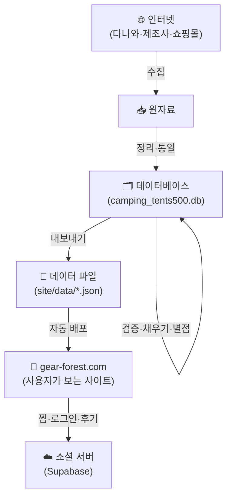
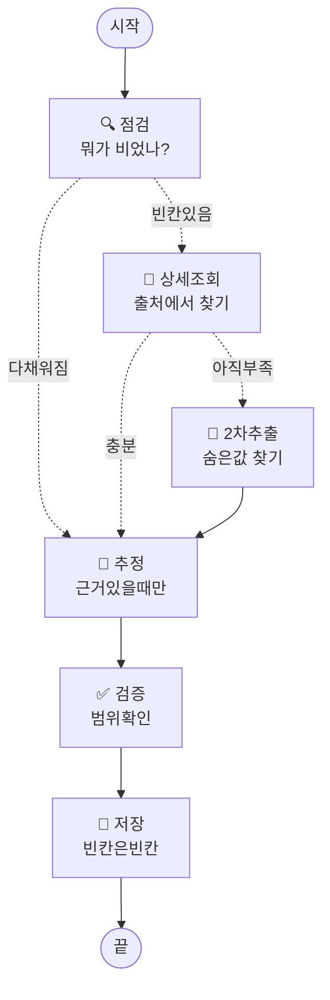
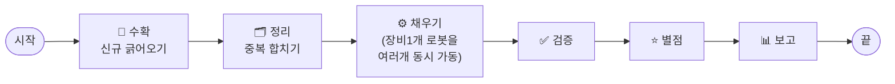

# 장비의 숲 — 처음부터 끝까지 (비개발자용 가이드)

> 이 문서는 **개발을 모르는 사람도** '장비의 숲'이 어떻게 만들어지고 돌아가는지
> 처음부터 끝까지 이해할 수 있도록 쓴 설명서입니다. 코드 한 줄 몰라도 됩니다.

---

## 1. 한 문장 요약

> **흩어진 캠핑장비 정보를 모아서, 거짓 없이 정리하고, 별점을 매겨서, 누구나 비교할 수 있는 웹사이트(gear-forest.com)로 보여주는 시스템.**

핵심 가치는 딱 하나입니다 — **"모르는 건 모른다고 한다."**
숫자를 지어내지 않습니다. 이게 이 시스템 전체 설계의 뿌리입니다.

---

## 2. 비유로 이해하기 — '도서관 사서' 시스템

장비의 숲을 **도서관**이라고 생각해보세요.

| 도서관 | 장비의 숲 |
|---|---|
| 세상의 책들 | 인터넷에 흩어진 캠핑장비 정보 |
| 책을 수집하는 사서 | **수집 단계** (다나와 등에서 긁어옴) |
| 책을 분류·정리하는 사서 | **정리 단계** (단위 통일, 중복 제거) |
| "이 정보 진짜야?" 검수하는 사서 | **검증 단계** (말도 안 되는 값 걸러냄) |
| 책에 별점 라벨 붙이기 | **별점 단계** |
| 손님이 보는 서가·안내데스크 | **웹사이트** (gear-forest.com) |

이 사서들이 일하는 **순서와 규칙**을 컴퓨터가 자동으로 지키도록 만든 게 이 시스템입니다.

---

## 3. 전체 그림 (한눈에)

크게 **두 개의 세계**가 있습니다:

1. **데이터를 만드는 세계 (뒤편 주방)** — 정보를 모으고 다듬어 별점을 매기는 곳. (위 그림 A→D)
2. **사용자가 보는 세계 (손님 홀)** — 완성된 정보를 웹에서 보여주는 곳. (E→F)

이 문서는 주로 **뒤편 주방**, 그중에서도 가장 똑똑한 부분인 **'데이터 정제 로봇(LangGraph)'**을 자세히 설명합니다.

---

## 4. 데이터의 여행 — 6단계

장비 하나의 정보가 사이트에 뜨기까지 거치는 여정입니다.

### ① 수집 — "일단 모아온다"
다나와 같은 쇼핑 사이트에서 텐트·침낭·매트 등의 정보를 긁어옵니다.
- 이름, 가격, 무게, 방수 능력(내수압), 바닥 넓이 같은 **스펙(사양)**을 가져옵니다.
- 단, 사이트마다 적는 방식이 제각각이라 이대로는 비교가 안 됩니다.

### ② 정리 — "같은 건 하나로"
같은 제품인데 **색깔만 다른 것**, 이름만 살짝 다른 것을 하나로 합칩니다.
- 예: "헬리녹스 텐트 (블랙)" "헬리녹스 텐트 (그린)" → **하나의 대표 제품(canonical)**으로.
- 단위도 통일합니다: kg·lb·oz가 섞여 있으면 전부 그램(g)으로, inch는 cm로.

### ③ 검증 — "말이 되는 숫자야?"
누가 봐도 이상한 값을 걸러냅니다.
- 예: 텐트 무게가 2,167원? → 가격을 무게 칸에 잘못 넣은 것. **격리(따로 빼둠)**.
- 두 종류로 나눕니다:
  - **하드 오류** (절대 불가능한 값) → 아예 버림
  - **소프트 의심** (가능은 하지만 카테고리가 안 맞음) → 표시만 하고 사람이 검토

### ④ 채우기 — "빈칸을 메우되, 지어내지 않는다" ⭐
**이 시스템의 심장부**입니다. 5번 챕터에서 자세히 다룹니다.
빠진 스펙(예: 방수 능력이 비어있음)을 보충하되 — **출처에 없으면 빈칸으로 둡니다.**

### ⑤ 별점 — "공정하게 점수 매기기"
같은 부류끼리만 비교해서 별 1~5개를 매깁니다.
- 예: 침낭 보온력은 **1인용 침낭끼리만** 비교. 2인용 텐트랑 섞지 않음.
- 그래서 "이 카테고리 안에서 이 제품이 몇 점인지"가 공정하게 나옵니다.

### ⑥ 내보내기 — "사이트가 읽을 수 있는 형태로"
완성된 데이터를 웹사이트가 쓰는 파일(JSON)로 변환해서 내보냅니다.
이게 자동으로 gear-forest.com에 배포됩니다.

---

## 5. 심장부 — '데이터 정제 로봇' (LangGraph)

④ 채우기 단계가 가장 중요하고 똑똑한 부분입니다.
여기서 **LangGraph**라는 도구를 씁니다.

### 5-1. LangGraph가 뭔가요? (비유)

**'정해진 순서표를 절대 어기지 않는 공장 컨베이어 벨트'**라고 생각하세요.

보통 프로그램은 사람이 "이거 했다가, 저거 했다가" 자유롭게 시킵니다.
그러다 실수로 **"확인 안 하고 숫자를 지어내는"** 일이 생깁니다.

LangGraph는 그걸 **구조적으로 불가능하게** 만듭니다.
- 모든 작업이 **정거장(노드)**으로 나뉘어 있고
- 정거장 사이 이동은 **정해진 규칙(화살표)**으로만 가능합니다.
- "출처 확인 → 없으면 빈칸" 같은 규칙이 **벨트 자체에 박혀** 있어서 건너뛸 수 없습니다.

> **왜 이렇게까지?**
> 캠핑장비는 "방수 5,000mm" 같은 숫자 하나로 구매가 갈립니다.
> 그 숫자가 지어낸 거짓이면 사용자가 비 오는 날 낭패를 봅니다.
> 그래서 **"넘겨짚기(대충 추측)"를 코드 구조로 원천 차단**한 겁니다.

### 5-2. 장비 1개를 처리하는 정거장들

장비 한 개가 컨베이어 벨트를 타고 가는 모습입니다.

| 정거장 | 하는 일 | 거짓말 방지 장치 |
|---|---|---|
| **🔍 점검 (assess)** | 이 제품이 뭘 갖고 있고 뭐가 비었는지 확인 | 사실에서 출발 |
| **📡 상세조회 (fetch_detail)** | 다나와 상세페이지에서 빈칸 채우기 | **출처에 적혀 있을 때만** 채움. 없으면 그냥 넘어감 |
| **🔎 2차추출 (fetch_fallback)** | 상세설명 안에 숨어있는 값 찾기 (예: 설명 글 속 "수납 크기") | 실재하는 글에서만 뽑음 |
| **🧮 추정 (infer)** | 모델명·바닥넓이로 사용 인원 추측 | **근거 있을 때만**. 추측한 값엔 '추정' 딱지를 붙임 |
| **✅ 검증 (validate)** | 채운 값이 상식 범위인지 확인 | 이상하면 격리 |
| **💾 저장 (persist)** | 데이터베이스에 기록 | **빈칸은 빈칸으로** 저장. 절대 지어내지 않음 |

### 5-3. 핵심 규칙 5가지 (이게 전부입니다)

1. **출처 우선, 추정은 최후** — 진짜 출처에 있을 때만 사실로 기록.
2. **추정은 따로 표시** — 어쩔 수 없이 추측하면 '추정(inferred)' 딱지를 붙여 구분.
3. **빈칸을 허용** — 못 채우면 그냥 빈칸. 이게 신뢰의 핵심.
4. **모든 결정을 기록** — "왜 이 값이 이렇게 됐는지" 나중에 다 추적 가능.
5. **실패도 숨기지 않음** — 처리 중 오류가 나면 조용히 넘기지 않고 모아서 보고.

> 💡 **예시로 보는 정직함**
> 패킹부피(접었을 때 크기)는 다나와에 거의 안 적혀 있습니다.
> 다른 시스템이라면 대충 추정해 채울 수도 있지만,
> 장비의 숲은 **3%만 채우고 97%는 빈칸으로 둡니다.** 없는 걸 지어내느니 비워둡니다.

---

## 6. 전체 파이프라인 로봇 (큰 그림)

5번이 '장비 1개'를 처리하는 로봇이라면, 이걸 **전 과정에 걸쳐 묶은 큰 로봇**도 있습니다.

- **'채우기' 정거장**은 5번의 '장비 1개 로봇'을 **여러 대 동시에(4대씩 병렬)** 돌려 속도를 냅니다.
  - 수천 개 제품을 한 줄로 처리하면 오래 걸리니, 여러 줄을 동시에 처리합니다.
- 마지막 **'보고' 정거장**이 "몇 % 채워졌는지, 오류는 몇 건인지" 요약해줍니다.

---

## 7. 사용자가 보는 세계 (간단히)

뒤편 주방에서 완성된 데이터는 이렇게 손님에게 전달됩니다.

- 데이터를 GitHub에 올리면 **자동으로** 사이트에 반영됩니다 (수동 배포 없음).
- 로그인·찜하기·후기 같은 **사람 사이 기능**은 Supabase라는 별도 클라우드가 담당합니다.
- 사이트는 **앱처럼 설치**도 됩니다 (PWA — 폰 홈화면에 추가 가능).

---

## 8. 왜 이 구조가 좋은가 (정리)

| 보통의 방식 | 장비의 숲 |
|---|---|
| 코드가 자유롭게 흘러 실수로 값을 지어냄 | **컨베이어 벨트(LangGraph)**가 규칙을 강제 |
| 빈칸을 그럴듯하게 채워 신뢰 깨짐 | **빈칸은 빈칸으로** — 정직함이 경쟁력 |
| 오류가 조용히 묻힘 | 오류를 **모아서 보고** |
| 새 카테고리 추가가 어려움 | **설정 한 블록**만 추가하면 끝 (텐트→침낭→매트…) |
| 사람이 매번 배포 | GitHub에 올리면 **자동 배포** |

---

## 9. 더 알고 싶다면 (개발자용 문서)

이 문서는 큰 그림이고, 기술적 세부는 아래 문서에 있습니다.

| 문서 | 내용 |
|---|---|
| [`pipeline/README.md`](pipeline/README.md) | 파이프라인 실행법·확장법 |
| [`pipeline/GRAPH.md`](pipeline/GRAPH.md) | LangGraph 노드 상세·State 설계 |
| [`DATABASE-DESIGN.md`](DATABASE-DESIGN.md) | 데이터베이스 구조 |
| [`CONCEPT.md`](CONCEPT.md) | 서비스 기획·철학 |

---

*"구할 수 있는 건 다 구하고, 없는 건 날조 없이 비워둔다." — 이게 장비의 숲의 전부입니다.*
