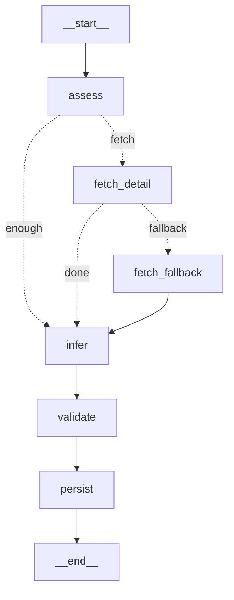
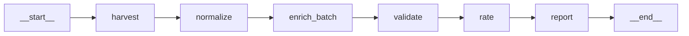

# LangGraph 채우기 파이프라인 (`graph_pipeline.py`)

기존 스크립트 호출 방식 → **상태그래프**로 전환. 목적: **"넘겨짚기(over-assume) 구조적 차단."**
모든 채우기 결정이 노드/조건엣지로 명시되고, 실행 경로가 로그로 추적됨.

## 그래프 구조


## 노드 책임
| 노드 | 하는 일 | 넘겨짚기 방지 장치 |
|---|---|---|
| **assess** | DB 현재 스펙 로드, 부족한 필수메트릭 판정 | 사실 기반 시작 |
| **fetch_detail** | 다나와 상세에서 부족분 채움 | **출처에 값이 있을 때만** 채움(find_spec→None이면 skip) |
| **fetch_fallback** | 보조출처(공식/리뷰) 폴백 | 미구현 시 **날조 대신 'missing 유지' 로그** |
| **infer** | 인원 등 파생추정 | **근거(모델명/바닥면적) 있을 때만**, `confidence='inferred'` 명시 |
| **validate** | 하드범위=파싱오류 격리 / 소프트=재분류 플래그 | 값 무결성 게이트 |
| **persist** | DB 기록 | **빈칸은 빈칸으로**(날조 금지), 멱등(source 3·4 재기록) |

## 조건엣지 (= 명시적 의사결정 지점)
- `assess → fetch_detail | infer` (`route_assess`) : 부족한 필수메트릭이 있을 때만 상세조회
- `fetch_detail → fetch_fallback | infer` (`route_after_detail`) : 상세 후에도 `packed_volume`이 부족하면 폴백, 아니면 통과. (`fetch_detail`이 채운 뒤 `missing` 재계산 → stale 라우팅 방지)

## State 설계 (단일 진실)
| 필드 | 역할 |
|---|---|
| `db` | **DB 경로 — 모든 노드가 `s["db"]`로 참조.** 전역 뮤터블 대신 State에 주입(동시실행 안전) |
| `specs` / `missing` | 현재 보유 스펙 / 아직 부족한 메트릭 |
| `fill_metrics` | **카테고리별 채울 메트릭.** 비면 `FILL`(텐트 기본)로 폴백. 호출부가 주입 |
| `errors` | 노드별 실패를 `{pid, node, err}`로 누적 → 침묵 삼킴 금지, report에서 집계 |
| `log` | 모든 결정의 실행경로 추적 |

## 핵심 원칙
1. **출처 우선, 추정 최후** — 실제 출처에 값이 있을 때만 사실(fact)로 채움.
2. **추정은 격리·표기** — infer 노드만 추정하고, 근거 없으면 추정조차 안 함. 추정값은 `inferred` 라벨.
3. **빈칸 허용** — 못 채운 값은 missing으로 남김(=신뢰의 핵심).
4. **추적가능** — 모든 결정이 state.log에 남아 "왜 이 값이 이렇게 됐나" 재구성 가능.

## 실행
```bash
pip install -r requirements.txt   # langgraph
python3 pipeline/graph_pipeline.py --db camping_tents500.db --limit 6
```

## 전체 단일 그래프 (`graph_full.py`)
수집부터 별점까지 하나의 그래프. per-product 서브그래프를 enrich_batch 노드가 호출(그래프 안의 그래프).

- `--queries "헬리녹스 텐트"` 주면 harvest 노드가 신규 수확, 없으면 스킵
- `--enrich-limit -1` 전체 / 0 생략 / N 상위N

### enrich_batch 노드 (병렬 서브그래프 실행)
- 채울 게 남은 제품마다 per-product 서브그래프(`graph_pipeline`)를 **`ThreadPoolExecutor(4)`로 병렬** 실행.
- 카테고리별 `FILL_BY_CATEGORY`(텐트/타프/침낭)를 `fill_metrics`로 주입.
- 서브그래프 `errors`를 모아 `FullState.errors`로 누적 → `report` 노드가 건수·상위 5건 출력.
- 동시 쓰기 대비: `persist`의 sqlite 커넥션 `timeout=30`. (검증: 병렬 8종 실행 오류 0건)

**실측 결과 (912종 배치, enrich 532종 처리):**
| 메트릭 | 전 | 후 |
|---|---|---|
| 내수압 | 43% | **77%** |
| 바닥면적 | 46% | **74%** |
| 적정인원 | 82% | **91%** (infer 노드가 모델명/바닥서 채움) |
| 패킹부피 | 12% | 12% (다나와 구조적 희소 — 정직하게 유지) |
| 가격/무게 | 100/91% | 100/91% |
→ 구할 수 있는 건 다 구하고(내수압·바닥·인원 ↑), 없는 건(패킹부피) 날조 없이 유지.

## 기존 스크립트와의 관계
graph_pipeline은 기존 모듈(`danawa`, `normalize`, `pipeline`, `validate_ranges`, `harvest_tents`)의
함수를 **노드 구현으로 재사용**. 로직 중복 없이 "오케스트레이션만" 그래프로 승격.
→ 향후 harvest/normalize/rating까지 노드로 흡수하면 전체 파이프라인이 단일 그래프가 됨.
