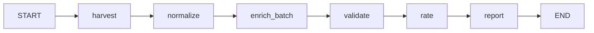
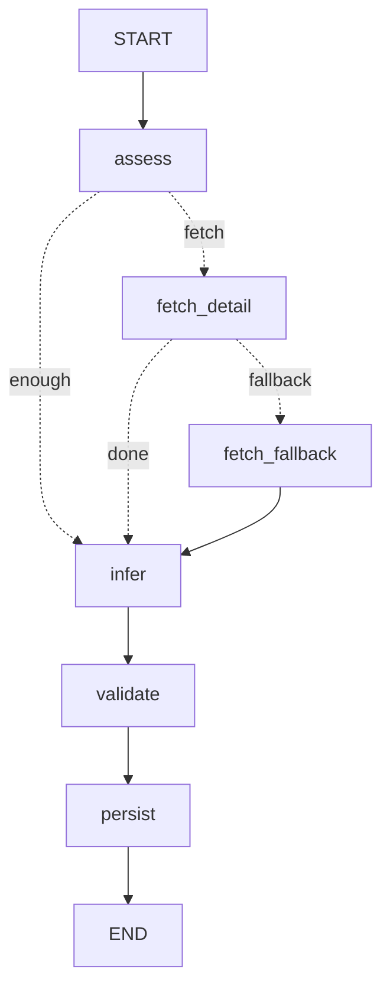

# 수집 파이프라인 (다나와 → 정규화 → SQLite)

DATABASE-DESIGN.md의 "자동 80% + 사람 20%" 파이프라인을 실제 구현한 것.
**표준 라이브러리만** 사용 (별도 설치 불필요).

## 구성
| 파일 | 역할 |
|---|---|
| `whitelist.csv` | **[사람]** 정확 모델명 + 다나와 pcode (= 해자/입력) |
| `danawa.py` | 다나와 페이지 fetch + `<meta Description>` 스펙 파싱 |
| `normalize.py` | 단위 정규화 (kg/lb/oz→g, inch→cm, sqft→m2 등) + 셀프테스트 |
| `reference.sql` | 카테고리/메트릭/출처/스타일 뼈대 |
| `pipeline.py` | 오케스트레이터: 수집→정규화→INSERT→품질플래그→별점→리포트 |

## 실행
```bash
cd ~/idea/camping-gear-app
python3 pipeline/normalize.py     # 단위변환 셀프테스트
python3 pipeline/danawa.py 16247885   # 단일 pcode 파싱 확인
python3 pipeline/pipeline.py      # 전체 파이프라인 → camping_auto.db 생성
```

## 동작 확인된 것 (라이브 데이터, 11개 제품 / 3개 카테고리)
- **텐트·침낭·매트**를 동일 파이프라인으로 수집 (SPEC_MAP만 카테고리별로 정의)
- 정규화: 무게(kg/lb/oz→g), 내수압(mm), 바닥면적(m²), 내한온도(℃·음수), 충전량(g), 두께(cm→mm)
- **별점은 카테고리 × 인원 세그먼트 안에서** min-max 계산
  (예: 매트 두께 1인용/2인용 따로, 침낭 내한온도 -23℃→★5)
- **가격**: 네이버쇼핑 봇차단(418) → 다나와 최저가 사용. 11개 중 5개 수집, 6개 '없음'→플래그
- **자동 품질검출 14건**: 카테고리 오태깅(그늘막/비치), 인원 불일치(다나와 3인용↔화이트 2인용),
  R값 전무(매트), 내수압/충전량 누락, 가격 없음 등

## LangGraph 아키텍처 (오케스트레이션)

스크립트 직접호출 방식을 **상태그래프**로 승격. 목적: **"넘겨짚기(over-assume) 구조적 차단"** — 모든 채우기 결정이 노드/조건엣지로 명시되고 실행경로가 `state.log`로 추적됨. 상세는 [`GRAPH.md`](GRAPH.md).

### 전체 그래프 (`graph_full.py`) — 수집→별점

| 노드 | 하는 일 |
|---|---|
| **harvest** | (옵션) `--queries`로 신규 수확. 없으면 스킵 |
| **normalize** | 색상/옵션 변형 → canonical 통합 |
| **enrich_batch** | 채울 게 남은 제품마다 per-product 서브그래프를 **병렬(4스레드)** 실행 |
| **validate** | 전체 타당범위 검증(하드=격리/소프트=재분류) |
| **rate** | 카테고리×인원 별점 재계산 |
| **report** | 메트릭 커버리지 + enrich 오류 집계 출력 |

### per-product 서브그래프 (`graph_pipeline.py`) — 제품 1건 채우기

`assess`(보유스펙 판정) → `fetch_detail`(출처에 있을 때만 채움) → `fetch_fallback`(2차추출) → `infer`(근거 있을 때만 추정) → `validate`(범위검증) → `persist`(빈칸은 빈칸, 멱등).

### 설계 원칙
1. **출처 우선, 추정 최후** — 실제 출처에 값이 있을 때만 fact로 채움.
2. **추정 격리·표기** — `infer` 노드만 추정, 근거 없으면 추정조차 안 함(`confidence='inferred'`).
3. **빈칸 허용** — 못 채운 값은 missing 유지(=신뢰의 핵심, 날조 금지).
4. **State가 단일 진실** — `db`·`fill_metrics`·`errors`를 State에 주입(전역 뮤터블 없음 → 동시실행 안전).
5. **추적가능** — 모든 결정이 `state.log`에, 실패는 `state.errors`에 누적(침묵 삼킴 금지).

## 확장 방법 (실증됨)
1. **제품 추가**: `whitelist.csv`에 한 줄(카테고리/모델/pcode) → 재실행. 끝.
2. **카테고리 추가**: `reference.sql`에 category + metrics 추가 + `pipeline.py`의
   `SPEC_MAP`/`REQUIRED`에 매핑 몇 줄. (침낭·매트가 이 방식으로 추가됨)
3. **출처 추가**(가격 등): `danawa.py`처럼 어댑터 작성 → `price_observations` 적재.

## 알려진 한계 (= 다음 과제)
- **가격이 최약점**: 네이버 차단 + 다나와 절반 '없음'. → 공식 API(네이버쇼핑/쿠팡파트너스) 필요.
- 다나와는 **R값·수납크기 등 일부 메트릭 미표기 잦음** → 보조 출처 필요.
- 크기 필드 본체/이너 혼재 → 휴리스틱 적용했으나 케이스별 검증 필요.
- pcode는 사람이 화이트리스트에 넣어야 함(= 의도된 검증 게이트 = 해자).
